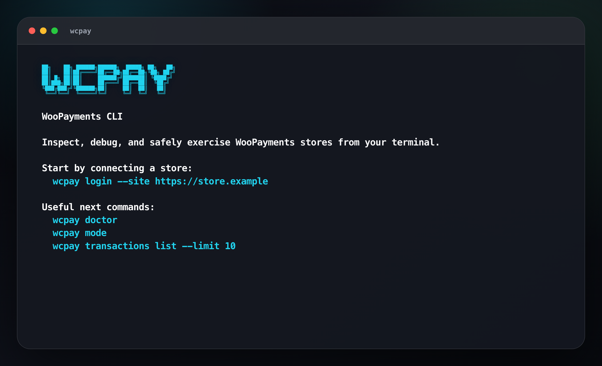
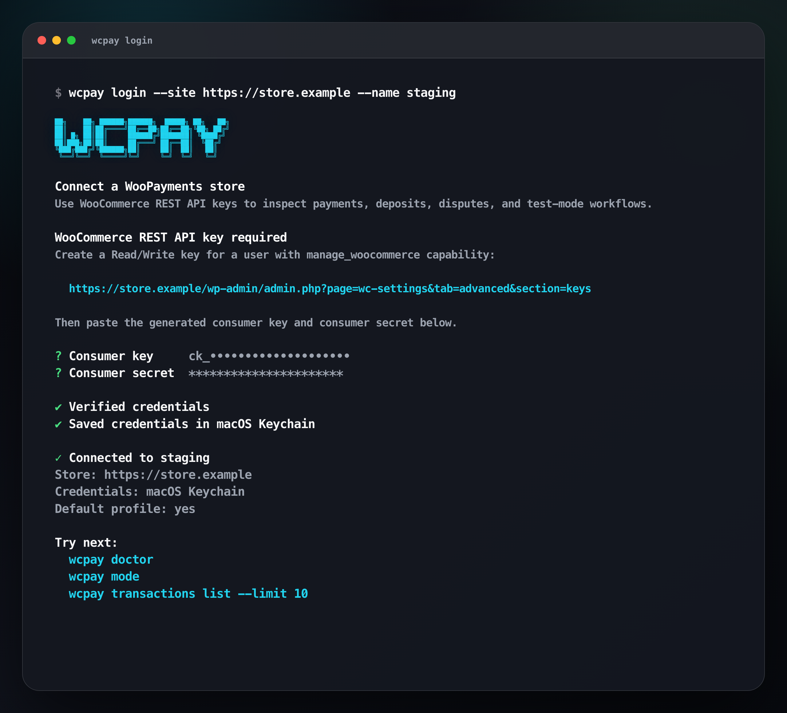
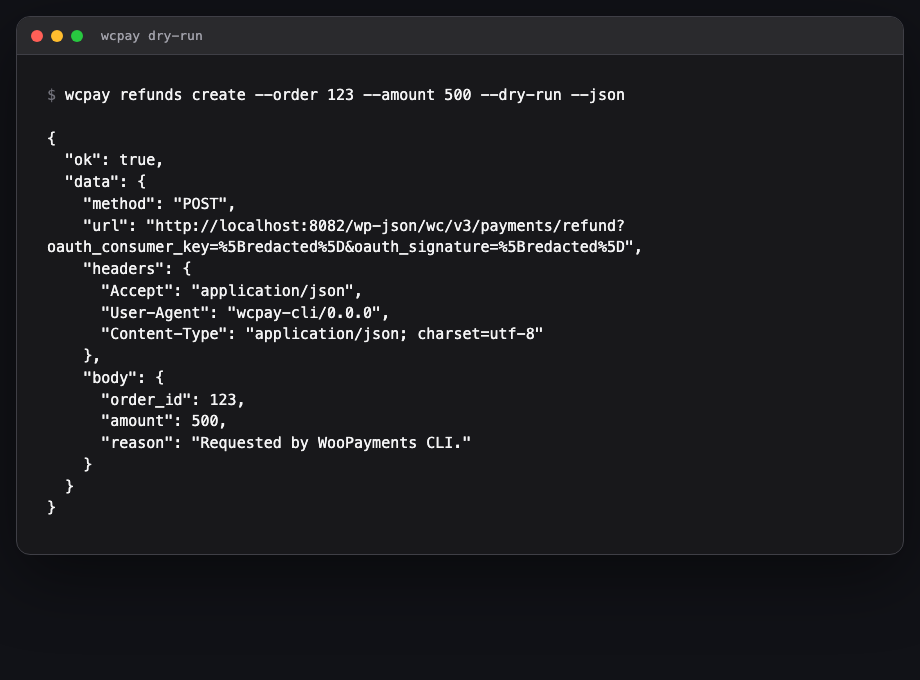

# WooPayments CLI

`wcpay` gives you a terminal-native way to understand what is happening on a WooPayments store without opening wp-admin or writing one-off REST scripts.

Use it when you need to answer questions like:

- Is this store connected and running in live, test, or dev mode?
- What are the latest transactions, deposits, disputes, or charges?
- What request would a refund, authorization capture, or test payment send?
- Can an agent or script safely inspect this store with structured JSON output?

The CLI works with local and remote stores, stores credentials keychain-first, and treats live stores as read-only. Write-capable commands are only allowed when WooPayments is in test/dev mode, and they require either `--dry-run` or `--yes`.

## What it feels like

Running `wcpay` without a command gives a short, terminal-native starting point:



The login flow uses browser-based WooPayments authorization when the store supports it, falls back to manual WooCommerce REST API key entry for older stores, verifies the connection, and suggests useful next commands:



## Start here

Install and link the CLI from this checkout:

```bash
npm install
npm run build
npm link
```

Connect a store with the guided login flow:

```bash
wcpay login --site https://store.example --name staging
```

The wizard saves credentials in your OS keychain when available. Browser login creates read-only WooCommerce REST API keys by default; pass `--scope read_write` only for write-capable test/dev workflows.

Then check that the CLI can talk to WooPayments:

```bash
wcpay doctor
wcpay mode
wcpay account status
```

For local development stores, HTTP is supported for localhost-style URLs:

```bash
wcpay login --site http://localhost:8082 --name local --no-verify
```

## Common workflows

### Check store health

```bash
wcpay doctor
wcpay doctor --json --redact
```

Use `doctor` before debugging a store. It verifies the selected profile, site URL, credentials, and WooPayments mode.

### Inspect money movement

```bash
wcpay transactions list --limit 25
wcpay deposits list
wcpay deposits get po_...
wcpay disputes list
wcpay disputes get dp_...
wcpay charges get ch_...
```

These commands are read-only and safe to run against live stores.

### Try a write safely

```bash
wcpay refunds create --order 123 --amount 500 --dry-run
wcpay authorizations capture --order 123 --intent pi_... --dry-run
```

`--dry-run` resolves the request, checks the store mode, redacts secrets, and prints what would be sent without making the write request.



### Use the underlying REST API

```bash
wcpay api get /wc/v3/payments/accounts --json
wcpay api get /wc/v3/payments/transactions page:=1 pagesize:=25 --json
```

The raw API command is useful when a curated command does not exist yet. Non-read methods still use the same live-mode guard and are limited to reviewed WooPayments/WooCommerce paths unless `--allow-unsafe-path` is passed explicitly.

### Work with agents

```bash
wcpay mcp
```

`wcpay mcp` starts a local stdio MCP server with read-only WooPayments tools. It uses the same profiles, credentials, and safety model as the CLI.

## Authentication and storage

`wcpay login` uses browser authorization where available, then stores WooCommerce REST API consumer keys/secrets. Secrets are stored in the OS keychain when available:

- macOS: Keychain via `security`
- Linux: Secret Service via `secret-tool`

If the OS keychain is unavailable, the CLI fails with instructions instead of silently writing secrets to disk. Set `WCPAY_KEYRING=0` to explicitly use file-backed secret storage for CI/containers.

## Documentation

- [Getting started](docs/getting-started.md)
- [Authentication](docs/auth.md)
- [Safety model](docs/safety.md)
- [Command guide](docs/commands.md)
- [Generated command reference](docs/command-reference.generated.md)
- [API command syntax](docs/api.md)
- [MCP](docs/mcp.md)
- [Packaging and release](docs/packaging.md)

## Package identity

- Repository: `Automattic/wcpay-cli`
- npm package: `@automattic/wcpay-cli`
- binary: `wcpay`
